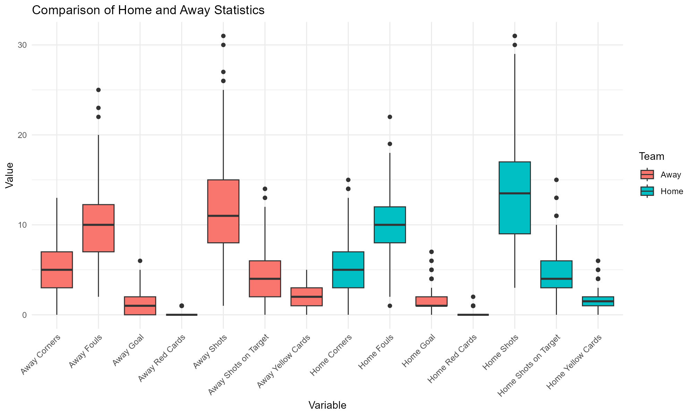
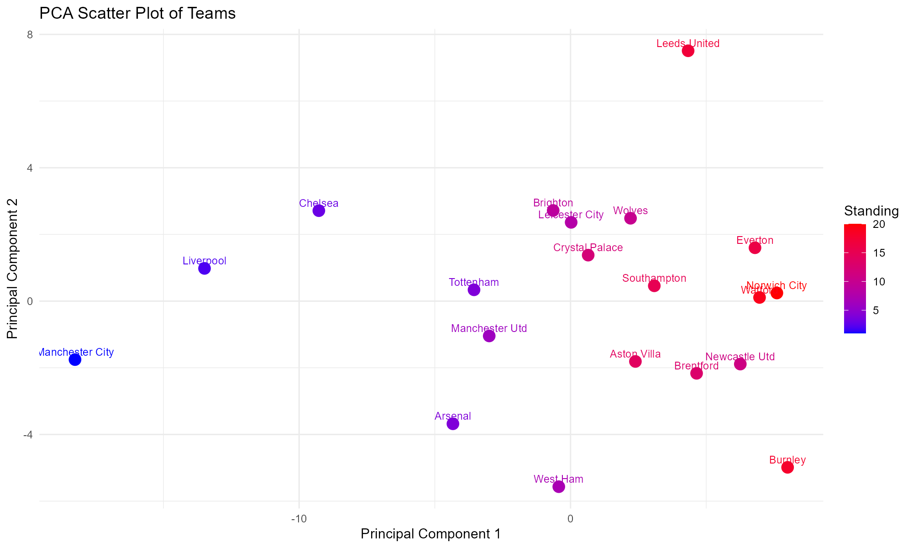

```{r setup, include=FALSE}
knitr::opts_chunk$set(echo = TRUE)
```

```{r, echo=FALSE}
setwd("D:/study/UNC_Biostatistics/2024 fall/BIOS 611/project")
```

# Background

The home Field advantage is believed to exists in many sports such as soccer, football, and basketball. It refers to the benefit that the home team is said to gain over the visiting team. Some of the factors that results in home field advantage are familiarity with the playing environment, reduced travel fatigue, referee bias, and also the presence of home supporters, whose vocal encouragement and psychological impact can motivate the home team and pressure the opposition. The English Premier League (EPL) is regarded as one of the most popular and competitive soccer leagues around the world. We are interested in verifying if the home field advantage significantly influence the results of matches in. In the meantime, we are also interested in the relationship between the standing and defending/passing/possession/shooting performance of teams. Thus, we are going to use datasets of season 2021-2022 of EPL to investigate the following questions:

**1. ** Is the home team more likely to get a win or draw than the away team?

**2. ** Is the home team less likely to get yellow orred cards than the away
team?

**3. ** Is the home team more likely to have more goals than the away team?

**4. ** If we cluster teams with their defending/passing/possession/shooting performance, are teams within a cluster close in the standing?

**5. ** Which of the above performance is most important to predict the standing of a team?

# Data sets

We used 2 data sets downloaded from kaggle. The first one contains The results of the total 380 matches as well as some match statistics including goals, shots, shots on target, corners, fouls, yellow cards, red cards. The second data set contains a series of statistics to measure the defending/passing/possession/shooting performance of each team in this season such as team goals, team total shots.

Link of the data sets:

https://www.kaggle.com/datasets/mechatronixs/20212022-season-england-premier-league-team-data?select=england_premier_league_squad_shooting_22.csv

# 1. Match Results and Home Field

The first data set is used for this question. Figure 1 is a box plot of the match statistics for home teams and way teams

```{r, fig.cap="Box Plot of Match Statistics", out.width="70%", fig.align="center", echo=FALSE}

```
According to this graph, home teams tends to have more shots and less yellow cards than way teams.

```{r, fig.cap="Pie Plot of Match Results", out.width="60%", fig.align="center", echo=FALSE}

```

Figure 2 is a pie plot of the match results. According to this graph, without adjusting for other variables home teams has a higher chance to win the game.

We separated the first data set into 200 data sets by the team. Each new data sets contains 38 games a team played in this season. We fitted logistic regression on each data set. We didn't use the whole data set to fit a single logistic regression because the match results of home teams and away teams are strongly negatively correlated. If the home team wins, the away team can only draw of lose. The response of the logistic regressions is whether the team got win or draw in that match. 

The outcome of the logistic regressions are if the team got a win or draw in this match. The covariates includes number of goals, fouls, shots, shots on target, yellow cards and red cards.

Table 1 show the estimated coefficients of home field for each team adjusted p-values. P-values are adjusted since this analysis involves multiple testing.

```{r, fig.cap="Coefficients with Adjusted P-values", out.width="70%", fig.align="center", echo=FALSE}
winordraw_home <- read.csv("winordraw_home_adjusted.csv")
knitr::kable(winordraw_home, caption = "Home Coefficient by Team")
```
This results shows that after adjusting for goals, fouls, shots, shots on target, yellow cards and red cards, the association between home field and match results is not significant for every team. This is a surprising result, but this may due to that the home field advantage affects the match results by mediation of goals, fouls, shots, shots on target, yellow and red cards. Thus, after adjusting them, the direct effect of home field on the match results is not significant.


# 2. Home Field and Yellow/Red Cards

The first data set is used for this question. We fitted 2 zero-inflated Poisson mixed effect models to investigate the association between home field and yellow cards/red cards. Zero-inflated Poisson model is used because in most matches there is no red card. We also included a random effect for teams since the yellow and red cards in games of the same team might be correlated. The outcomes are the number of yellow cards and the number of red cards in each match. The covariates includes number of goals, fouls, corners, shots, and shots on target.

```{r, fig.cap="Coefficients for Yellow Cards", out.width="70%", fig.align="center", echo=FALSE}
yellow <- read.csv("fixed_effects_yellow.csv")
knitr::kable(yellow, caption = "Home Coefficient for Yellow Cards")
```
```{r, fig.cap="Coefficient for RedCards", out.width="70%", fig.align="center", echo=FALSE}
red <- read.csv("fixed_effects_red.csv")
knitr::kable(red, caption = "Home Coefficient for Red Cards")
```

Table 2 and table 3 are the estimated coefficents for the two models.After adjusting for other variables. According to the results, the yellow cards and red cards are not significantly associated with home fields. This implies the referee bias is not significant with respect to the red and yellow cards.

# Home Field and Goals

Again the first data set is used for this question. We fitted a Poisson Mixed effect model. The outcome is the number of goals the team scored in each game. The covariates includes number of fouls, corners, shots, and shots on target, yellow and red cards

```{r, fig.cap="Coefficients for Goals", out.width="70%", fig.align="center", echo=FALSE}
goal <- read.csv("fixed_effects_goal.csv")
knitr::kable(goal, caption = "Home Coefficient for Goal")
```
Table 4 are the estimated coefficents for the models.After adjusting for other variables, the number of goals is not significantly associated with home field. This might be because we adjusted for shots and number of shots. The presence of home supporters might have slight psychological impact on the away goalkeeper, but the impact is usually not that big for professional goalkeepers.


# 4. Cluster by Team Season Statistics 

The second data set is used for this and the next question. We included 89 team season statistics that measures the defending, passing, possession, and shooting performances of the teams.

We first applied PCA on the 89 variables and made a scatter plot of the 20 teams with the first 2 principal components. Figure 3 contains this scatter plot.

```{r, fig.cap="Scatter Plot of Teams with First 2 Principal Components", out.width="80%", fig.align="center", echo=FALSE}

```

From Figure 3, the first component is strongly correlated with the standing. Teams on the left tends to have higher ranking and teams on the right have lower ranking. From left to right, the first 6 teams, "Man City", "Liverpool", "Chelsea", "Arsenal", "Tottenham", and "Man United", are exact in the same order as the standing.

We then use KNN to cluster the 20 teams into 4 clusters. Since KNN does not work well in high dimension, we still use the PCA to reduce the dimension. Figure 4 is a plot of the variance explained by each principal component and the cumulative variance explained. The elbow is on the second component. Thus, we use the first 2 components for the clustering, and the cluster is plotted in figure 5.

```{r, fig.cap="Variance Explained by Each Principal Components", out.width="60%", fig.align="center", echo=FALSE}

```

```{r, fig.cap="Clusters in Scatter Plot with First 2 Principal Components", out.width="80%", fig.align="center", echo=FALSE}

```
The cluster works pretty good for the top 2 clusters. Teams with ranking 1, 2, 3 are in the same cluster, and teams with ranking 4, 5, 6, 7 are in the same cluster. However, the third and forth clusters does not perfectly separate the teams. These might be because those teams are close to each other in the first component. Overall, the cluster perform well. Thus, those team in the same cluster are closer to each other.


# 5. Random Forest for Performance Importance.

We first use PCA on each of defending variables, passing variables, possession variables, and shooting variables to get the first principal component, totally 4 principal components. Then, we fitted a random forest with classes to be the top 10 in standing or the last 10. The number of features in each tree is set to be $\sqrt{4}=2$. The reduced Gini Index is used as a measure of the importance in Figure 6.

```{r, fig.cap="Importance of Performance", out.width="60%", fig.align="center", echo=FALSE}

```

From the results, sassing performance is the most important to predict if the team is among top 10, followed by possession performance, shooting performance and defending performance.


# Conclusion

From this project, we don't have enough evidence to show the association between match results, yellow and red cards, and goals and home field advantage, after adjusting for other match statistics. We also showed that after clustering teams by season defending, passing, possession, and shooting performance, the teams in the same cluster are close to each other. Passing performance is most important to predict the standing of a team.

Limitation is we after adjusting for other match statistics, we may ignored the effect of home field on the match results by mediation of these match statistics. Thus, a future work can be to investigate those effect.


